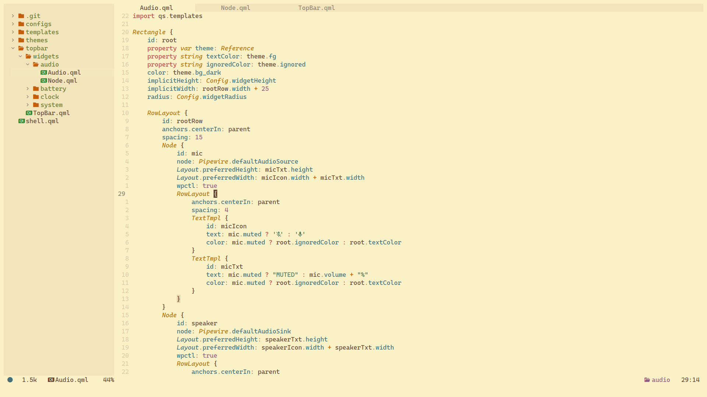
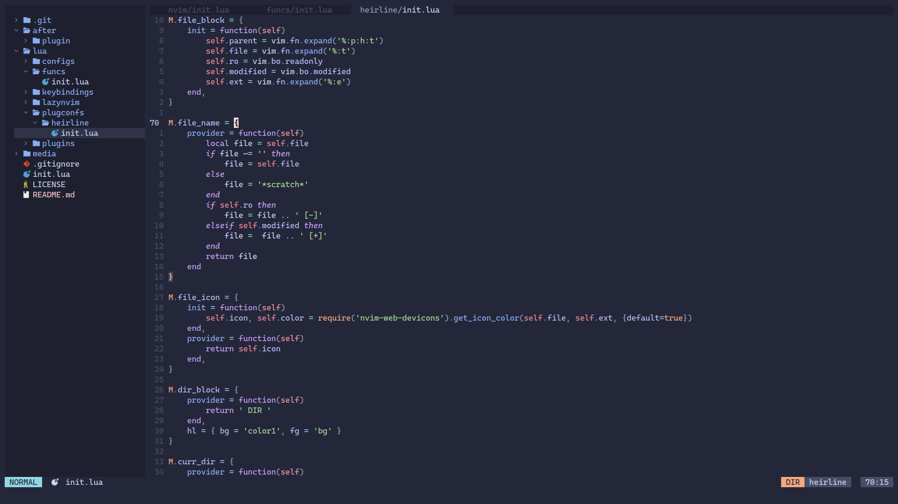
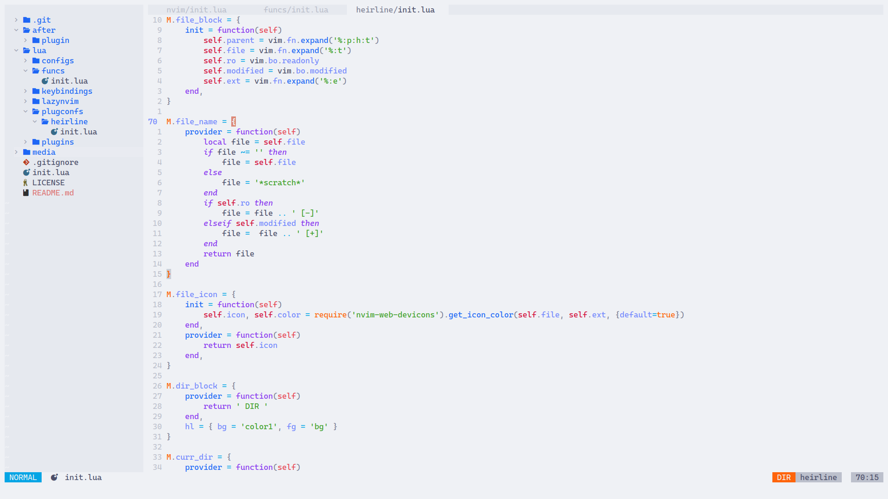

Lightweight neovim configuration in ~500 LOC. Includes **bufferline**, **oil.nvim**, **nvim-tree**, **nvim-treesitter**, **gruvbox-material**, **catppuccin** theme among other plugins, and a custom made statusline with **heirline**. Doesn't have LSP integration.

