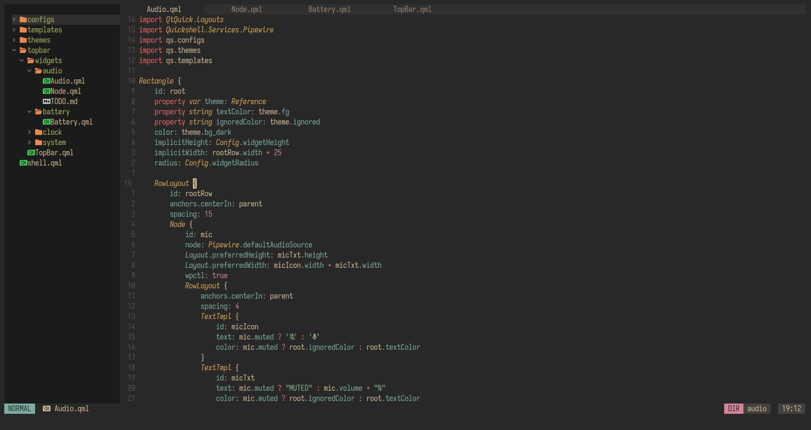

Lightweight neovim configuration under 500 LOC. Includes **bufferline**, **oil.nvim**, **nvim-tree**, **nvim-treesitter**, **gruvbox-material** theme and a custom made statusline with **heirline**. Doesn't have LSP integration.

